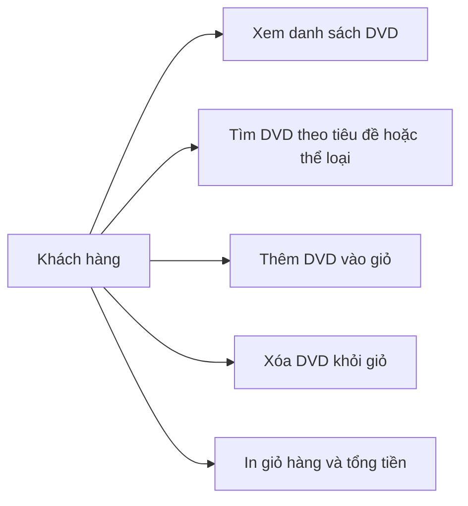

# AIMS-mini: ca sử dụng

```mermaid
flowchart LR
    Khach[Khách hàng] --> Xem[Xem danh sách DVD]
    Khach --> Tim[Tìm DVD theo tiêu đề hoặc thể loại]
    Khach --> Them[Thêm DVD vào giỏ]
    Khach --> Xoa[Xóa DVD khỏi giỏ]
    Khach --> In[In giỏ hàng và tổng tiền]
```

Giỏ hàng nhận tối đa 20 DVD. Mỗi DVD có tiêu đề, thể loại, đạo diễn,
thời lượng và giá. Chức năng giảm giá nhận phần trăm từ 0 đến 100.
